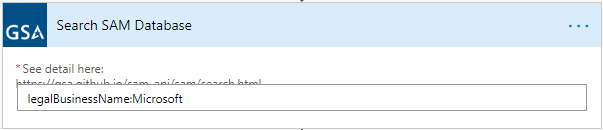

# GSA-SAM-Connector

Power Platform Custom Connector for the GSA SAM API (https://gsa.github.io/sam_api/sam/console/). This is a Power Platform custom connector for interacting with the US Government's General Servies Administration (GSA) System for Award Management (SAM) database. This is a database of US Government contractors. 
# API Key
All calls to the GSA SAM API require an API key.  The process for betting that API is described on the GSA API site here: [https://gsa.github.io/sam_api/sam/key](https://gsa.github.io/sam_api/sam/key)
This will provide an API key that you will need to create a connection with this custom connector.
# Methods
This connector supports two methods:
## Search SAM Database

Search the SAM database to return a set of companies and related metadata.  The search queries any of these fields:

 - Legal Business Nme
 - Doing-Business-As Name
 - DUNS
 - DUNS+4
 - CAGE Code
 - DoDAAC

The queries automatically append a wildcard (*) so searches for "Micro" will match "Microsoft".  
### Advanced Search
Advanced search can be executed by prepending the query field such as:

Will search only the Legal Business Name field for "Microsoft*"

See the available advanced search fields and Boolean logic on the  [API Documentation](https://gsa.github.io/sam_api/sam/search.html)

### Returned Values
The results include the values described in the [API Documentation](https://gsa.github.io/sam_api/sam/search.html)

## Find By DUN+4 Number

This returns a detailed description of the business identified by the DUNS+4 number.  Note that this *requires* a DUNS+4 number.  DUNS+4 numbers are 13 digits.  Typically a nine-digit DUNS number can be converted to a DUNS+4 number by appending "0000".  The results from a **Search SAM Database** query returns fields "DUNS" and "DUNS+4" which can be concatenated to create a DUNS+4 number.
Definitions of the output fields are on the [API Documentation](https://gsa.github.io/sam_api/sam/getdatafields.html).
